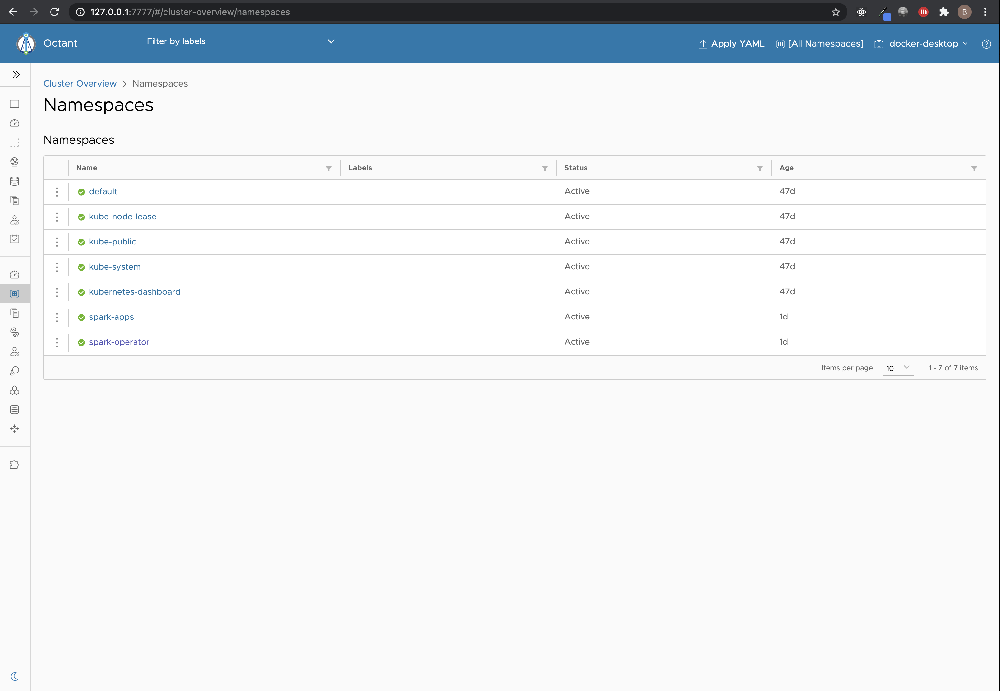
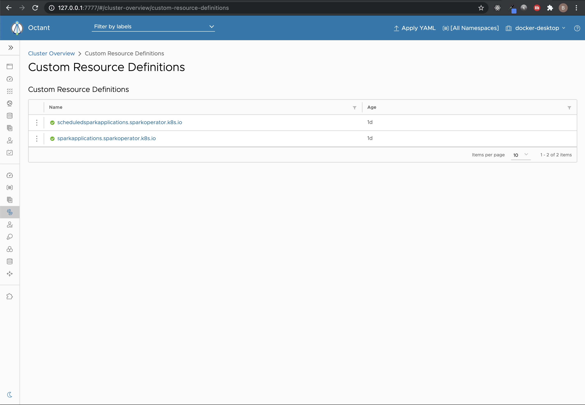
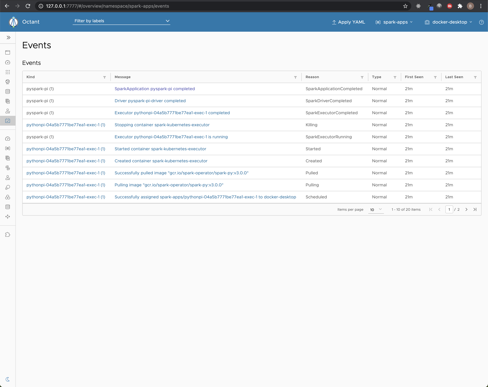

# Spark Operator Setup

The following is a set of steps that will allow you to deploy the <a href="https://github.com/GoogleCloudPlatform/spark-on-k8s-operator">Spark Operator</a> to a local Kubernetes (K8s) cluster. The Spark Operator is an open source K8s Operator that makes deploying Spark applications in K8s much easier compared to the basic spark-submit script. We will use it in production to centralize our Spark application configuration and Spark application management, including scheduling, log capture and monitoring. It is also, an effective way to locally develop and test Spark applications in K8s.

1) <b>Setup a Kubernetes Cluster</b>

To deploy and run spark applications in a local Kubernetes (K8s) environment you can either install <a href="https://minikube.sigs.k8s.io/docs/start/">minikube</a> or if you already installed <a href="https://www.docker.com/products/docker-desktop">Docker</a> you can simply leverage the K8s environment setup by Docker. If you leverage K8s installed by Docker you may also want to setup the K8s dashboard (Note: It is already installed in minikube). Here are the steps you can follow to setup the K8s native dashboard: 

```
kubectl apply -f https://raw.githubusercontent.com/kubernetes/dashboard/v2.0.4/aio/deploy/recommended.yaml
kubectl create serviceaccount dashboard-admin-sa
kubectl create clusterrolebinding dashboard-admin-sa --clusterrole=cluster-admin --serviceaccount=default:dashboard-admin-sa
```

To start the dashboard you run:

```
kubectl proxy
```

This will make the Dashboard available at:<br/>
<a href="http://localhost:8001/api/v1/namespaces/kubernetes-dashboard/services/https:kubernetes-dashboard:/proxy/">http://localhost:8001/api/v1/namespaces/kubernetes-dashboard/services/https:kubernetes-dashboard:/proxy/</a>

To obtain an access token to log into the dashboard:

```
kubectl get secrets
kubectl describe secret dashboard-admin-sa-token-<copy from previous command>
```

Note: I use both minikube and Docker for local K8s testing and prefer to use a 3rd party dashboard tool called <a href="https://octant.dev/">Octant</a>. In my opinion, it provides a much nicer interface for visualizing workloads in K8s vs. the native K8s dashboard.

2) <b>Setup Kubernetes objects for the Spark Operator</b>

Once you have your K8s environment running the next step is to setup K8s for the Spark Operator. Included in this repository is a spark-operator-setup.yaml file, which will create two K8s namespaces, one for the operator and one for Spark applications. Additionally, it creates a service account for Spark applications and a cluster role binding to grant the edit cluster-level role to the newly created service account.

From the root directory of this repository, run the following:

```
kubectl create -f spark-operator.yaml
```

Sample output:

```
brett@Bretts-iMac spark-deployment-sample % kubectl create -f spark-operator-setup.yaml
namespace/spark-operator created
namespace/spark-apps created
serviceaccount/spark created
clusterrolebinding.rbac.authorization.k8s.io/spark-operator-role created
```

The newly created objects should show up in your dashboard. For example:



3) <b>Install the Spark operator</b>

Now we are ready to install the Spark operator using the following Helm 3 commands:

```
helm repo add spark-operator https://googlecloudplatform.github.io/spark-on-k8s-operator

helm install sparkoperator spark-operator/spark-operator --namespace spark-operator --set webhook.enable=true,sparkJobNamespace=spark-apps
```

Note: In production, we will enable metric collection as well, so we need to add “enableMetrics=true” to the “—-set” command.

Sample output:

```
brett@Bretts-iMac spark-deployment-sample % helm install sparkoperator spark-operator/spark-operator --namespace spark-operator --set sparkJobNamespace=spark-apps,enableWebhook=true
NAME: sparkoperator
LAST DEPLOYED: Mon Dec 14 14:54:41 2020
NAMESPACE: spark-operator
STATUS: deployed
REVISION: 1
TEST SUITE: None
```

If it is installed correctly you should see two new custom resource definitions in your K8s cluster. For example:



4) <b>Test the operator using sample Spark applications</b>

Once the spark-operator is deployed you can run the pyspark test with the following command:

```
kubectl apply -f spark-py-test.yaml
```

If the PySpark test application is created successfully you will be able to see it running using the following command:

```
kubectl get sparkapplications pyspark-pi -o=yaml --namespace=spark-apps
```

The sample pulls a pre-built image from GCP, so it takes a few seconds for the application to run within Kubernetes. I used Octant to verify the application ran and completed as expected. The events should be visible in your spark-apps namespace:



